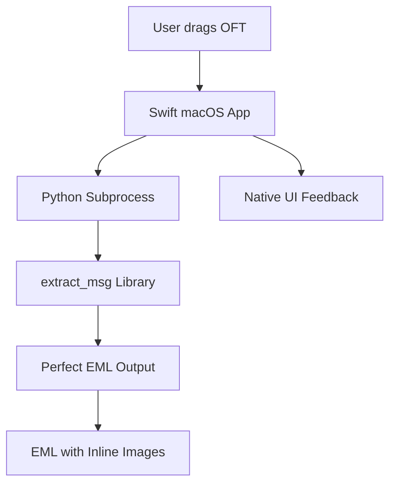

# OFT to EML Converter for macOS

<div align="center">


**A native macOS application for converting Outlook Template (.oft) files to EML format**

[](https://developer.apple.com/macos/)
[](https://swift.org/)
[](https://www.python.org/)
[](LICENSE)

</div>

## Features

✅ **Native macOS Experience**
- Drag & drop interface built with Swift and Cocoa
- Native success/error dialogs and file handling
- Integrates seamlessly with Finder

✅ **Perfect Conversion Quality**  
- Preserves HTML and plain text formatting
- Maintains inline images with correct Content-IDs
- Complete multipart/related MIME structure
- Handles large files (750KB+ outputs)

✅ **Reliable MSG Parsing**
- Uses proven `extract_msg` Python library
- Supports complex OFT file structures  
- Handles German text and UTF-8 encoding correctly

## Screenshots

<div align="center">

| Drag & Drop Interface | Conversion Success |
|:---:|:---:|
|  |  |

</div>

## Quick Start

### 1. Setup Dependencies
```bash
git clone https://github.com/yourusername/oft-eml-converter-mac.git
cd oft-eml-converter-mac
chmod +x scripts/setup.sh && ./scripts/setup.sh
```

### 2. Run Tests (Optional)
```bash
chmod +x scripts/test.sh && ./scripts/test.sh
```

### 3. Build Application
```bash
chmod +x scripts/build.sh && ./scripts/build.sh
```

### 4. Launch & Use
```bash
open OFT-EML-Converter.app
```

Drag `.oft` files onto the application window to convert them to `.eml` format.

## System Requirements

- **macOS 10.15** (Catalina) or later
- **Python 3.7+** (usually pre-installed on macOS)
- **Xcode Command Line Tools** (for building from source)

## Architecture



This hybrid approach combines:
- **Swift/Cocoa** for native macOS user experience
- **Python extract_msg** for reliable MSG/OFT parsing
- **Subprocess communication** for clean separation of concerns

## Project Structure

```
├── src/                      # Source code
│   ├── OFTEMLConverter.swift # Native macOS app
│   └── converter.py          # Python MSG parser
├── scripts/                  # Build and setup scripts
│   ├── build.sh             # App builder
│   └── setup.sh             # Dependency installer
├── assets/                   # Resources
│   └── icon.png             # Application icon
├── examples/                 # Sample files
│   └── sample.oft           # Test OFT file
├── docs/                    # Documentation
└── README.md               # This file
```

## Advanced Usage

### Command Line Conversion
If you prefer command line usage:
```bash
python src/converter.py input.oft output.eml
```

### Batch Conversion
The GUI supports multiple file drag & drop for batch processing.

### Custom Python Environment
The app automatically detects and uses:
1. Virtual environment Python (if `venv/` exists)
2. Homebrew Python (`/opt/homebrew/bin/python3`)
3. System Python (`/usr/bin/python3`)

## Troubleshooting

### "Python not found" Error
Run the setup script to install dependencies:
```bash
./scripts/setup.sh
```

### "extract_msg not available" Error
Install manually for your Python:
```bash
pip3 install --break-system-packages extract_msg
```

### Detailed Error Information
The app provides comprehensive error messages including:
- Python paths attempted
- Exact error from subprocess
- Working directory and file paths
- Full command line used

## Contributing

1. Fork the repository
2. Create your feature branch (`git checkout -b feature/amazing-feature`)
3. Commit your changes (`git commit -m 'Add some amazing feature'`)
4. Push to the branch (`git push origin feature/amazing-feature`)
5. Open a Pull Request

## License

This project is licensed under the MIT License - see the [LICENSE](LICENSE) file for details.

## Acknowledgments

- Built with [extract_msg](https://github.com/TeamMsgExtractor/msg-extractor) library
- Inspired by the need for reliable OFT to EML conversion on macOS
- Thanks to the Swift and Python communities

---

<div align="center">

**Made with ❤️ for the macOS community**

</div>