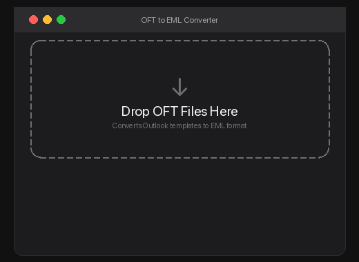

# OFT to EML Converter for macOS

<div align="center">



**Convert Outlook Template (.oft) files to EML — just drag and drop.**

[](https://developer.apple.com/macos/)
[](https://swift.org/)
[](LICENSE)

</div>

A lightweight macOS app that converts `.oft` files to standard `.eml` format. No configuration needed — it installs its own Python environment on first launch.

## Features

- **Drag & drop** — drop one or many `.oft` files, get `.eml` files next to them
- **Zero setup** — auto-installs Python dependencies into a private venv on first run
- **Native UI** — SwiftUI with SF Symbols, dark mode, animated hover states, and progress feedback
- **Conversion history** — see results, reveal output files in Finder, clear the list
- **Reliable parsing** — uses the proven [extract_msg](https://github.com/TeamMsgExtractor/msg-extractor) library under the hood
- **Preserves everything** — HTML, plain text, inline images with Content-IDs, UTF-8 encoding

## Quick Start

### Download

Grab the latest `.app` from [**Releases**](https://github.com/trsdn/oft-eml-converter-mac/releases), or build from source:

```bash
git clone https://github.com/trsdn/oft-eml-converter-mac.git
cd oft-eml-converter-mac
./scripts/build.sh
open OFT-EML-Converter.app
```

### What happens on first launch

1. The app checks for Python 3 and the `extract_msg` library
2. If missing, it creates a virtual environment in `~/Library/Application Support/OFT-EML-Converter/venv` and installs everything automatically
3. If Python itself is missing, you'll see a **Download Python** button linking to [python.org](https://www.python.org/downloads/macos/)

No `pip install`, no `brew`, no terminal needed.

## System Requirements

- **macOS 14** (Sonoma) or later
- **Python 3** — the app will guide you if it's not installed

## Command Line

You can also convert files directly:

```bash
python3 src/converter.py input.oft output.eml
```

## How It Works

```
┌──────────────────┐   subprocess   ┌─────────────────┐
│  SwiftUI App     │ ────────────►  │  converter.py   │
│  (drag & drop)   │                │  (extract_msg)  │
└──────────────────┘                └─────────────────┘
         │                                   │
    native UI                          .eml output
    feedback                        with inline images
```

The app is a thin SwiftUI shell that delegates parsing to a Python script via subprocess. This keeps the UI fast and native while leveraging the battle-tested `extract_msg` library for the complex MSG/OFT binary format.

## Project Structure

```
src/
├── OFTEMLConverter.swift   # SwiftUI app, dependency checker, converter bridge
└── converter.py            # Python OFT→EML conversion engine
scripts/
├── build.sh                # Builds the .app bundle
├── setup.sh                # Manual dependency installer (optional)
└── test.sh                 # Test suite runner
tests/
├── test_app.swift          # Swift integration tests
└── test_converter.py       # Python unit tests
```

## Contributing

1. Fork the repository
2. Create your feature branch (`git checkout -b feature/amazing-feature`)
3. Commit your changes
4. Push and open a Pull Request

## License

MIT — see [LICENSE](LICENSE).

This project uses [extract_msg](https://github.com/TeamMsgExtractor/msg-extractor) (GPL-3.0) as a runtime dependency installed separately via pip. The MIT license applies to the source code in this repository.