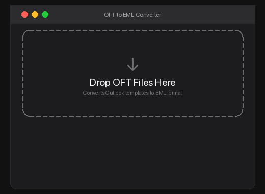

# OFT to EML Converter for macOS

<div align="center">



**Convert Outlook Template (.oft) files to EML — just drag and drop.**

[](LICENSE)
[](#system-requirements)
[](https://github.com/trsdn/oft-eml-converter-mac/actions/workflows/test.yml)
[](https://github.com/trsdn/oft-eml-converter-mac/releases)
[](docs/self-assessment.md)

</div>

A lightweight macOS app that converts `.oft` files to standard `.eml` format. No configuration needed — it installs its own Python environment on first launch.

Its language is English, and it ships no localized content. See `L01` and `L03`.

**Everything happens on your Mac.** The app reads the files you drop on it and writes the results next to them. It transmits nothing. See [Data handling](#data-handling).

## Features

- **Drag & drop** — drop one or many `.oft` files, get `.eml` files next to them
- **Zero setup** — auto-installs Python dependencies into a private venv on first run
- **Native UI** — SwiftUI with SF Symbols, dark mode, animated hover states, and progress feedback
- **Conversion history** — see results, reveal output files in Finder, clear the list
- **Reliable parsing** — uses the proven [extract_msg](https://github.com/TeamMsgExtractor/msg-extractor) library under the hood
- **Preserves everything** — HTML, plain text, inline images with Content-IDs, UTF-8 encoding

## Quick Start

### Download

Grab the latest signed DMG from [**Releases**](https://github.com/trsdn/oft-eml-converter-mac/releases), or build from source:

```bash
git clone https://github.com/trsdn/oft-eml-converter-mac.git
cd oft-eml-converter-mac
./scripts/build.sh
open OFT-EML-Converter.app
```

### What happens on first launch

1. The app checks for Python 3 and the `extract_msg` library
2. If missing, it creates a virtual environment in `~/Library/Application Support/OFT-EML-Converter/venv` and installs everything automatically
3. If Python itself is missing, you'll see a **Download Python** button linking to [python.org](https://www.python.org/downloads/macos/)

No `pip install`, no `brew`, no terminal needed.

## System Requirements

- **macOS 14** (Sonoma) or later
- **Python 3** — the app will guide you if it's not installed

## Data handling

- **What is collected:** nothing. No telemetry, no analytics, no crash reporting.
- **What is transmitted:** nothing. Conversion runs locally, and the app does not resolve remote references even when the HTML body it copies contains them.
- **What is stored, and where:** converted `.eml` files land next to their source. The app keeps its private Python environment in `~/Library/Application Support/OFT-EML-Converter/`. Delete that folder to reset the app completely; it is recreated on the next launch.
- **Outbound network destinations:** two, neither of them during conversion.
  - **PyPI**, once on first launch, to install `extract_msg` into the private environment.
  - **Apple's notarization check**, performed by macOS itself the first time you open the app. That is Gatekeeper, not this application.

## Accessibility

- The app is a standard AppKit-hosted SwiftUI application, so it inherits system text sizing, Dark Mode, and Increase Contrast.
- Files can be opened without dragging: the window's file picker is reachable from the keyboard, and the command line entry point below does the same job without any GUI at all.
- **Known limitations, stated rather than left to be discovered:** the interface has not been audited with VoiceOver, and the accessible names of its custom drop area come from SwiftUI defaults rather than from labels chosen for the purpose. Full keyboard operability of the drop area has not been verified. Tracked in [#10](https://github.com/trsdn/oft-eml-converter-mac/issues/10).

## Versioning

This project follows [Semantic Versioning](https://semver.org/spec/v2.0.0.html). Releases are tagged `vMAJOR.MINOR.PATCH`, and the tag is the single source of the version embedded in the app bundle — `CFBundleShortVersionString` is injected by the release build and verified against the tag before anything is signed.

The running version is shown under **OFT EML Converter → About**, alongside links to the repository and the issue tracker. See the [changelog](CHANGELOG.md).

## Command Line

You can also convert files directly:

```bash
python3 src/converter.py input.oft output.eml
```

## Signed Releases

To build a signed and notarized DMG locally, copy `.release.env.example` to `.release.env`, fill in your Apple Developer details, then run:

```bash
scripts/release-macos.sh
```

Pushing a `v*` tag triggers the GitHub release workflow, which builds and notarizes the DMG automatically. It requires these repository secrets: `MACOS_CERTIFICATE`, `MACOS_CERTIFICATE_PWD`, `APPLE_ID`, `APPLE_TEAM_ID`, `APPLE_APP_PASSWORD`.

The version in the bundle is taken from the tag, never written by hand, and the release build stops if the two disagree.

## Published site

[trsdn.github.io/oft-eml-converter-mac](https://trsdn.github.io/oft-eml-converter-mac/) is served by GitHub Pages from the `docs/` directory on `main`. It is a single self-contained page: no external fonts, scripts, images, or analytics, which a CI check enforces on every push.

## How It Works

```
┌──────────────────┐   subprocess   ┌─────────────────┐
│  SwiftUI App     │ ────────────►  │  converter.py   │
│  (drag & drop)   │                │  (extract_msg)  │
└──────────────────┘                └─────────────────┘
         │                                   │
    native UI                          .eml output
    feedback                        with inline images
```

The app is a thin SwiftUI shell that delegates parsing to a Python script via subprocess. This keeps the UI fast and native while leveraging the battle-tested `extract_msg` library for the complex MSG/OFT binary format.

## Project Structure

The repository layout, the authoritative build and validation commands, and the paths that are generated rather than hand-maintained are documented once, in [AGENTS.md](AGENTS.md).

Deeper background lives in [docs/ARCHITECTURE.md](docs/ARCHITECTURE.md) and [docs/TESTING.md](docs/TESTING.md).

## Contributing

See [CONTRIBUTING.md](CONTRIBUTING.md).

## Security

Report vulnerabilities privately. See [SECURITY.md](SECURITY.md).

## Support status

Actively maintained by [@trsdn](https://github.com/trsdn). Issues and pull requests are welcome; response times are best-effort.

## Repository activity

<picture>
  <source media="(prefers-color-scheme: dark)" srcset="https://raw.githubusercontent.com/trsdn/oft-eml-converter-mac/stats/.github/stats/repo-card-dark.svg">
  
</picture>

## License

MIT — see [LICENSE](LICENSE).

This project uses [extract_msg](https://github.com/TeamMsgExtractor/msg-extractor) (GPL-3.0) as a runtime dependency installed separately via pip. The MIT license applies to the source code in this repository.
