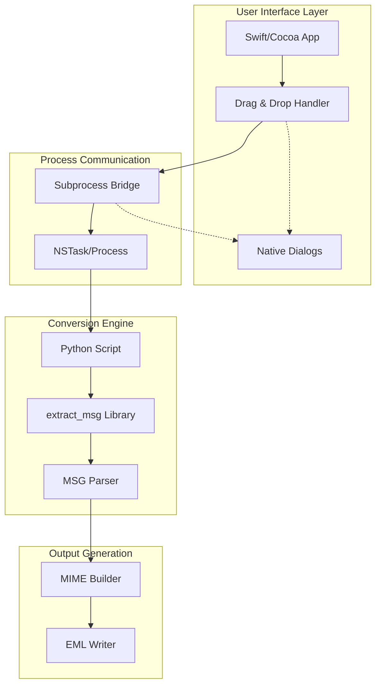
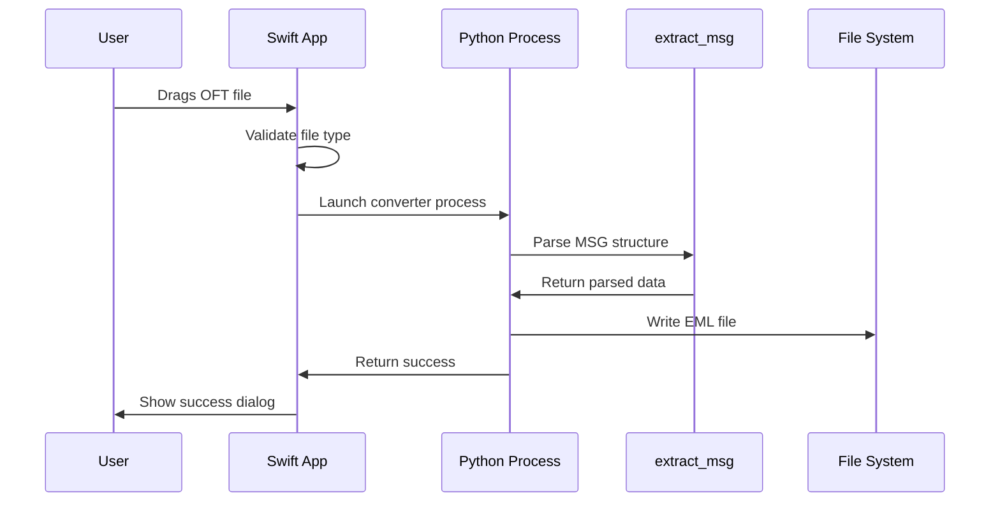
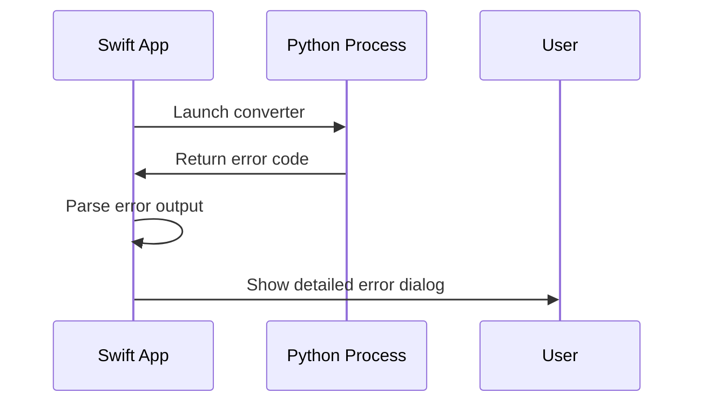

# Architecture Overview

## Design Philosophy

The OFT to EML Converter follows a **hybrid architecture** that combines the strengths of native macOS development with proven Python libraries for complex file parsing.

## System Architecture



## Component Details

### 1. Swift macOS App (`src/OFTEMLConverter.swift`)

**Responsibilities:**
- Native macOS user interface
- File drag & drop handling
- Process management and error handling
- User feedback through native dialogs

**Key Classes:**
- `AppDelegate`: Main application controller
- `DropView`: Handles drag & drop operations
- `ConversionError`: Typed error handling

**Design Decisions:**
- Uses `NSApplication` for native macOS integration
- `NSDraggingInfo` protocol for file drag handling
- `Process` class for subprocess communication

### 2. Python Converter (`src/converter.py`)

**Responsibilities:**
- MSG/OFT file parsing using extract_msg
- MIME structure generation
- EML file writing with proper encoding

**Key Features:**
- Handles complex MSG compound document structure
- Preserves inline images with Content-IDs
- Supports both HTML and plain text content
- Proper UTF-8 encoding for international text

### 3. Process Communication Bridge

**Architecture:**
```swift
Process() → Python Script → stdout/stderr → Swift App
```

**Communication Flow:**
1. Swift app creates `Process` instance
2. Sets executable to Python interpreter
3. Passes script path and arguments
4. Captures stdout/stderr for feedback
5. Monitors exit status for success/failure

**Error Handling:**
- Comprehensive Python path detection
- Detailed error reporting with full context
- Graceful fallback between Python installations

## Data Flow

### Successful Conversion


### Error Handling


## File Format Handling

### Input: OFT Files
- **Format**: Microsoft MSG (compound document)
- **Structure**: OLE2 storage with MAPI properties
- **Content**: Email template with potential attachments

### Output: EML Files
- **Format**: RFC 5322 compliant email
- **Structure**: MIME multipart/related
- **Encoding**: UTF-8 with base64 for binary content

### MIME Structure Generated
```
multipart/related
├── multipart/alternative
│   ├── text/plain (UTF-8)
│   └── text/html (UTF-8)
└── image/* (inline attachments with Content-ID)
```

## Python Environment Detection

### Search Order:
1. `venv/bin/python` (project virtual environment)
2. `/opt/homebrew/bin/python3` (Homebrew)
3. `/usr/bin/python3` (system Python)
4. `/usr/local/bin/python3` (custom installation)

### Validation Process:
1. Check if Python executable exists
2. Verify `extract_msg` library availability
3. Set appropriate working directory
4. Launch subprocess with error capture

## Security Considerations

### Subprocess Security:
- No shell expansion (direct executable path)
- Validated input file paths
- Controlled working directory
- Limited subprocess permissions

### File Handling:
- Validates file extensions before processing
- Checks file existence before conversion
- Proper error handling for permission issues
- No arbitrary code execution

## Performance Characteristics

### Memory Usage:
- **Swift App**: ~10MB base memory
- **Python Process**: ~30MB + file size
- **Peak Usage**: ~50MB for typical OFT files

### Processing Speed:
- **Small OFT (<1MB)**: ~1-2 seconds
- **Large OFT (>5MB)**: ~3-5 seconds
- **Inline Images**: +1-2 seconds per image

### Scalability:
- Single file processing (no batch queuing)
- Memory released after each conversion
- No persistent Python process

## Error Recovery

### Failure Points & Recovery:
1. **Python Not Found**: Show setup instructions
2. **extract_msg Missing**: Guide user to installation
3. **File Permissions**: Clear permission error message
4. **Corrupt OFT**: Python error with file details
5. **Disk Space**: File system error handling

## Future Architecture Considerations

### Potential Improvements:
- **Persistent Python Process**: Reduce startup overhead
- **Progress Indicators**: For large file processing  
- **Batch Processing**: Queue multiple files
- **Plugin Architecture**: Support additional formats

### Scalability Options:
- Background processing thread
- File processing queue
- Progress reporting mechanism
- Cancel operation support